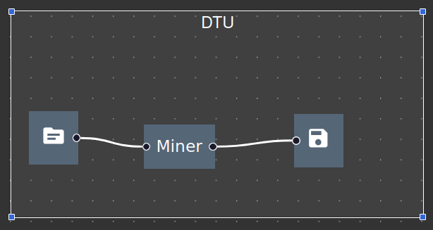

# DAPM
More information on how to run the Frontend and Backend can be found in the folders README files.

Frontend uses Typescript with React as the Frontend Javascript framework and React Material UI is used to make component creation and styling easier. Frontend uses Redux for state management.

Backend uses containerized components that communicate with each other through a Docker network. Backend uses RabbitMQ (MQTT) for message producing and consuming. "The RabbitMQLibrary folder holds all the code related to asynchronous communication using message queues. It contains the consumers and producers base clases, as well as the message models."


# Local Installation

This guide provides instructions for installing both the Backend and Frontend locally.

## Prerequisites

Before you begin, ensure you have the following installed:

- **Node.js** (v12.x or later): [Download Link](https://nodejs.org/en/download/package-manager)
- **npm** (v6.x or later): [Same as above](https://nodejs.org/en/download/package-manager)
- **Docker** (For Backend): [Install Docker](https://docs.docker.com/desktop/)
- **.NET 8.0** (8.0.401 is the newest on Linux, or might cause problems for Linux users): [Install .NET 8.0](https://learn.microsoft.com/en-us/dotnet/core/install/linux-scripted-manual#manual-install)

## Running Backend and Frontend

### Step 1: Run the Backend

1. First, set up the `/etc/hosts/` file by adding `127.0.0.1 rabbitmq` to the end (first time only).
2. If Docker complains about paths (e.g., `/ASP.NET/Https` or `/Microsoft/UserSecrets`), add these paths in Docker Desktop Settings under **Resources > File Sharing**, then press **+** to add them.
3. Open two terminal windows.
4. In the first terminal, navigate to `Backend/DAPM` and run the following command to build and start the Docker containers:
    ```bash
    docker compose up --build
    ```
   If you do not want to block the terminal, you can add the `-d` option to run in detached mode:
    ```bash
    docker compose up --build -d
    ```

Once the containers are up and running, you can interact with the platform using the Client API. The Client API is deployed at port 5000. You can access the Client API at the following URL:
- [Client API Swagger](http://localhost:5000/swagger/v1/swagger.json)

### Step 2: Run the Frontend

1. In the second terminal, navigate to `Frontend/` and run the following command to install dependencies (only the first time):
    ```bash
    npm install
    ```
2. Start the frontend application by running:
    ```bash
    npm start
    ```

The user client interface will be available at:
- [Frontend UI](http://localhost:3000)

# Virtual Machine Deployment

This guide explains how to deploy the Backend and Frontend on a Linux virtual machine.

## Prerequisites for VM Deployment

1. Enter `sudo` mode using the following command:
    ```bash
    sudo -i
    ```

2. Install the following software:
   - **Node.js** (v12.x or later): [Download Link](https://nodejs.org/en/download/package-manager)
   - **npm** (v6.x or later): [Same as above](https://nodejs.org/en/download/package-manager)
   - **Docker** (For Backend, install the command-line version): [Install Docker](https://docs.docker.com/desktop/)
   - **.NET 8.0** (8.0.401 is the newest on Linux, or might cause problems for Linux users): [Install .NET 8.0](https://learn.microsoft.com/en-us/dotnet/core/install/linux-scripted-manual#manual-install)
   - **pm2** (to run the Frontend client interface): Install with the command:
     ```bash
     npm install pm2 -g
     ```

3. Generate an SSH key for the virtual machine with the following command:
    ```bash
    ssh-keygen -t rsa -b 4096
    ```

4. Add the public SSH key to your GitHub repository. You can find the public key with:
    ```bash
    cat ~/.ssh/id_rsa.pub
    ```

5. Clone the repository:
    ```bash
    git clone <repository-url>
    ```

6. Edit the file `/src/services/backendAPI.tsx` and uncomment line 13 to set `isVM = true;`.

## Step 1: Run the Backend in Detached Mode

1. Navigate to `Backend/DAPM` and run the following command to start the Docker containers in detached mode:
    ```bash
    docker compose up --build -d
    ```

Once the containers are up and running, you can interact with the platform using the Client API. The Client API is deployed at port 5000. You can access the Client API at:
- [Client API Swagger](http://se2-f.compute.dtu.dk:5000/swagger/index.html) (or a similar VM address).

## Step 2: Run the Frontend with pm2 in the Background

1. Navigate to `Frontend/` and run the following command to install dependencies (only the first time):
    ```bash
    npm install
    ```

2. Start the Frontend application in the background using `pm2`:
    ```bash
    pm2 --name FrontendPM2 start npm -- start
    ```

3. To see the running instances of the Frontend, you can use:
    ```bash
    pm2 ps
    ```

The user client interface will be available at:
- [Frontend UI](http://se2-f.compute.dtu.dk:3000/) (or a similar VM address).


### How correctly setup pipeline in Frontend client and deploy pipeline to Backend

- Under organization (DTU) create a repository

- In repository add a file



- Create a pipeline within an organization that has an input with a type and a file

- Connect to a miner or something

- Connect the miner or something to a data sink and set the data sink setting to a specific repository defined before

- Click on the line between the miner and the datasink and set the filename as something you want to store in the data sink