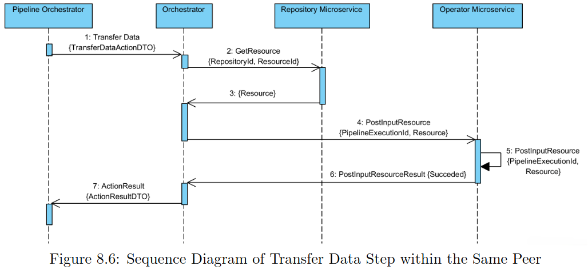

# DAPM


More information on how to run the Frontend and Backend can be found in the folders README files.

Frontend uses Typescript with React as the Frontend Javascript framework and React Material UI is used to make component creation and styling easier. Frontend uses Redux for state management.

Backend uses containerized components that communicate with each other through a Docker network. Backend uses RabbitMQ (MQTT) for message producing and consuming. "The RabbitMQLibrary folder holds all the code related to asynchronous communication using message queues. It contains the consumers and producers base clases, as well as the message models."

### Frontend API

#### Organisations

- GET /organisations
- GET /organisations/{organisationId}
- GET /organisations/{organisationId}/repositories
- POST /organisations/{organisationId}/repositories

#### Pipeline

- GET /organisations/{organisationId}/repositories/{repositoryId}/pipelines/{pipelineId}
- POST .../pipelines/{pipelineId}/executions
- POST .../pipelines/{pipelineId}/executions/{executionId}/commands/start
- GET .../pipelines/{pipelineId}/executions/{executionId}/status

#### Repository

- GET /organisations/{organisationId}/repositories/{repositoryId}
- GET /organisations/{organisationId}/repositories/{repositoryId}/resources
- POST /organisations/{organisationId}/repositories/{repositoryId}/resources
- GET /organisations/{organisationId}/repositories/{repositoryId}/pipelines
- POST /organisations/{organisationId}/repositories/{repositoryId}/pipelines
- POST /organisations/{organisationId}/repositories/{repositoryId}/resources/operators

#### Resource

- GET /organisations/{organisationId}/repositories/{repositoryId}/resources/{resourceId}
- GET /organisations/{organisationId}/repositories/{repositoryId}/resources/{resourceId}/file

#### Status

- GET /status/{ticketId}

#### System

- POST /system/collabhandshake


### Backend API

- POST /organizations/{organizationId}/repositories/{repositoryId}/resources
- POST /organizations/{organizationId}/repositories/{repositoryId}/resources/operators


### Prerequisites

Before you begin, ensure you have the following installed:
- Node.js (v12.x or later)
- npm (v6.x or later)
- Docker (For Backend)
- .NET 8.0 (8.0.401 is the newest on Linux)


### To run both

- First setup /etc/hosts/ by adding 127.0.0.1	rabbitmq to the end (first time only).

- (If docker complains about paths: /ASP.NET/Https OR /Microsoft/UserSecrets then add them at Docker Desktop Settings/Resources/File sharing , by writing the path and pressing +)

- Use 2 terminal windows

- Go to Backend/DAPM and run:

```
docker compose up --build
```

If you do not want to block the command line, you can add the option `-d`.

Once the containers are up and running, you can interact with the platform by using the Client API. The Client API is deployed in port 5000. You can interact with the Client API visiting the following link:

http://localhost:5000/swagger/v1/swagger.json


- Go to Frontend in a different window and run npm install (only on the first time).

- Run

```
npm start
```

The program is stated at http://localhost:3000

### How correctly setup pipeline in Frontend client and deploy pipeline to Backend

- Under organization (DTU) create a repository

- In repository add a file


- Create a pipeline within an organization that has an input with a type and a file

- Connect to a miner or something

- Connect the miner or something to a data sink and set the data sink setting to a specific repository defined before

- Click on the line between the miner and the datasink and set the filename as something you want to store in the data sink

- Deploy (currently deployment does not work)


### How to monitor pipelines states from the Backend



- The pipeline goes to the Backend through DAPM.ClientApi

- Then it is sent to DAPM.PipelineOrchestratorMS.Api

- The orchestrator loops through all the pipeline step asynchronously until all steps are complete

- Using the defined C# web sockets send data to the Frontend when pipeline has started and when it has finished

- Have the Frontend Receive these:

useEffect(() => {
    const socket = new WebSocket('ws://localhost:5000/ws');

    socket.onmessage = (event) => {
        const message = event.data;
        setPipelineUpdates((prevUpdates) => [...prevUpdates, message]);
    };

    socket.onerror = (error) => {
        console.error('WebSocket Error: ', error);
    };

    return () => socket.close();
}, []);


#### All the changes made to the software

- Fixed dockerfile so .net containers actually wait for rabbit mqtt to be fully operational before starting

- Removed form backend gitignore: DAPM/DAPM.Orchestrator/Services/Configuration/IdentityConfiguration.json, because orchestrator microservice cannot run without a organization defined in it

- Changed Frontend buttons to be disabled while submitting so userr does not accidentally submit many copies

- Fixed pipeline orcherstrator microservice to be able to use ticket id and handle errors

- Fixed orchestrator microservice to use the ticket id for process id instead of generating a random new id not related to anything

- added a function to check all available processes in the orchestrator microservice: _orchestratorEngine.GetProcessesDictionary()

- Added redux state for current browser sessions pipeline tickets

- Also API call that checks the status of all of the tickets of the current browser session